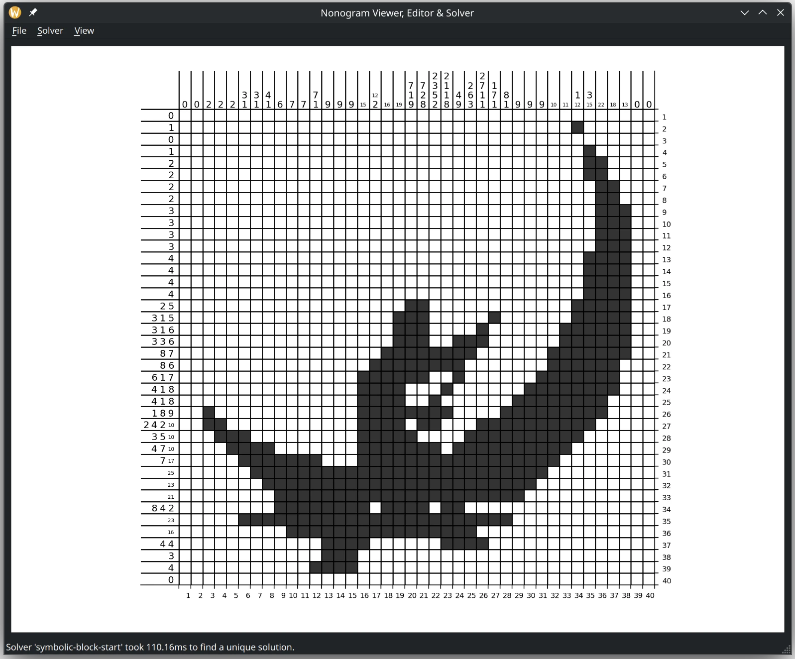

An ASP-based Nonogram Solver with uniqueness checking, as well as a GUI for creating, viewing, solving and editing Nonograms, with an integrated Image-to-Nonogram converter.

# Setup
We recommend running this python application in a virtual environment.
For example, you can do the following to set this up:
> python -m venv .venv
>
> source .venv/bin/activate
>
> pip install -r requirements.txt

# Nonogram GUI
You can start the interactive GUI with 
> python -m gui

By default, this will open the _Nonogram Generator_ window, where you can create a black and white image that will be turned into a nonogram after pressing 'OK'.
Alternatively, you can specify a nonogram encoding file to load at the start, skipping the generator. Lastly, you can give the name of a solver to immediately solve the loaded nonogram. 
Example uses:
> python -m gui nonograms/example_04.txt
> 
> python -m gui nonograms/example_03.lp sbs-improved

### Manual Solving
Inside the _Nonogram GUI_, you can try to solve a nonogram manually by left-clicking on the cells.
Multiple cells can be changed at once by dragging the mouse cursor. 
You can also mark cells with an 'x' by right-clicking them.
By default, unsatisfied hints are emphasized in red, you can disable this in the 'View' menu.

### Automatic Solving
You can also use the computer to solve the nonogram for you with the 'Solver' menu. Here you can also enable uniqueness checking and have an option to find all solutions to a given nonogram.
If a solver found multiple solutions, you can cycle through them using Ctrl + H and Ctrl + J, or the 'View' menu.

### Nonogram Editing
You can change any row or column hint directly by clicking on it and entering a valid list of numbers, separated by spaces.
You can also fill the grid arbitrarily and then turn that grid into a nonogram by pressing Ctrl + Shift + N, or by using the 'File/New from current solution' menu option.
Resizing the nonogram is not supported, you need to use the _Nonogram Generator_ to create a new one. 

## Nonogram Generator & Image-to-Nonogram converter
The _Nonogram Generator_ opens when you launch the application without parameters, or by pressing Ctrl + N from inside the _Nonogram GUI_.
Here you can create a nonogram yourself using the controls on the left hand side.
On the right hand side, you see a preview of the image encoded in your nonogram.

At the top of the left panel, you can adjust the grid size.
Then you can pick between three options:
1. An empty image (all white).
2. A randomly generated image - you can adjust the black-to-white ratio and how correlated neighbouring pixels are.
3. Load an image file and convert it to a nonogram - you can adjust the brightness threshold of the black and white image.

When you are happy with the preview on the right and the uniqueness properties of you nonogram, you can press OK (or hit 'Enter') to load it into the _Nonogram GUI_.

## Integrating other Nonogram Solvers into the GUI
We integrated four existing nonogram solvers into the project; most need to be compiled separately. We do not claim ownership or authorship over any of these source files and have only copied them into the repository for convenience.

### Nonogrid (https://github.com/tsionyx/nonogrid)
This solver written in Rust has been added as a submodule to the repository; it requires the rustup package and can be compiled using

> git submodule init nonogrid
>
> cd nonogrid
> 
> cargo build --release --features="args std_time sat"

The solver expects an input file consisting of one line of whitespace separated hints per row, an empty line, then one line of whitespace separated hints per column. 
It is wrapped by the 'SolutionHandler.run_nonogrid_solver(..)' function and supports both uniqueness checking and enumeration of all solutions.

### pbnsolve (https://webpbn.com/pbnsolve.html, https://code.google.com/archive/p/pbnsolve/downloads)
Version 1.09 of this solver written in C can be found in the 'pbnsolve' directory.
It requires installation of the zlib1g-dev and libxml2-dev packages, then it can be compiled with

> cd pbnsolve
> 
> make pbnsolve

For more information about this sovler, see the pbnsolve/README file. 
It is wrapped by the 'SolutionHandler.run_pbn_solver' function and supports uniqueness checking, but not finding of more than two solutions.

### copris-nonogram (https://cspsat.gitlab.io/copris-puzzles/nonogram/)
Version 2.0 of this nonogram solver written in Copris and embedded in Scala is included in the 'solvers' directory.
Running it requires a local installation of scala 2.12.12:
> sdk install scala 2.12.12

It is quite slow to start since it is running in a JVM.
We had success in making it run faster (at least for small nonograms) by compiling the source, which we have included in the 'copris' directory, into a .jar archive with

> cd copris
> 
> sbt assembly

and then we used AOT compilation to transform it into an executable using the 'native image' tool from GraalVM:

> native-image -cp "target/scala-2.10/copris-nonogram-assembly-1.2.jar" -H:+ReportExceptionStackTraces  -H:IncludeResources=".*" -H:Class=nonogram.Solver -H:Name=copris-aot --no-fallback

which was installed before using

> sdk install java 21.0.0.r11-grl
> 
> gu install native-image

It is wrapped by the 'SolutionHandler.run_copris_solver' function, which calls either the scala or the aot version. It supports uniqueness checking, but not enumerating all solutions.

### Ben-Gurion University (bgu) solver (http://www.cs.bgu.ac.il/~benr/nonograms/)
Version 1.02 of this solver written in Java is included in the 'solvers' directory.
It requires a local installation of java.
Similar to copris, we had success in using AOT compilation to make it considerably faster:

> cd solvers
> 
> native-image -cp "bgusolver_cmd_102.jar" -H:+ReportExceptionStackTraces  -H:IncludeResources=".*" -H:Class=JCIndependantSolver -H:Name=bgu-aot --no-fallback

It is wrapped by the 'SolutionHandler.run_bgu_solver' function, which calls either the java or the aot version. It supports uniqueness checking, and finding the number of solution, but can only return a single solution to look at.
